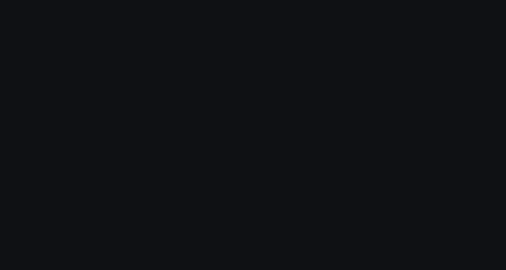

# mb · mini-browser for agents

Browser CLI for agents. Each command is a small Unix tool — reads args, writes stdout, composes with pipes and `&&`.

<p align="center">
  
</p>

<p align="center">
  <a href="https://www.npmjs.com/package/@runablehq/mini-browser"></a>
  <a href="https://runable.com/npm/@runablehq/mini-browser"></a>
  <a href="https://skills.sh/runablehq/mini-browser/mini-browser"></a>
</p>

## Setup

### As an agent skill (recommended)

```bash
npx skills add runablehq/mini-browser --all --global
```

This installs the `mini-browser` skill for all your agents via [skills.sh](https://skills.sh/runablehq/mini-browser/mini-browser). Your agent will automatically know how to use `mb` commands.

### As a global CLI

```bash
npm install -g @runablehq/mini-browser
```

### Then start Chrome

```bash
mb-start-chrome            # starts Chrome with --remote-debugging-port=9222
mb go "https://example.com"
```

> **Try it online** at [runable.com](https://runable.com/npm/@runablehq/mini-browser) — no install needed.

Also ships `mb-restart-chrome` to kill and relaunch the debug Chrome instance.

For local development: `bun install && bun run build`, then use `node dist/mb.js`.

### Chrome scripts

| Script | What it does |
|---|---|
| `mb-start-chrome` | Launches Chrome with `--remote-debugging-port=9222`. No-ops if already running. Creates a fresh profile each time so `--window-size=1024,768` is always respected. |
| `mb-restart-chrome` | Kills the running instance (via PID file) then calls `mb-start-chrome`. |

Both scripts honour these environment variables:

| Variable | Default |
|---|---|
| `CHROME_PORT` | `9222` |
| `CHROME_BIN` | auto-detected (`google-chrome-stable`, `chromium`, …) |
| `CHROME_PID_FILE` | `<scripts>/.chrome-pid` |
| `CHROME_USER_DATA_DIR` | `<scripts>/.chrome-profile` |

## Commands

```
Navigation:
  go <url>                    Navigate (waits for networkidle)
  url                         Print current URL
  back / forward              History navigation

Observe:
  text [selector]             Visible text (selector uses querySelector, default: body)
  shot [file]                 Screenshot (default: ./shot.png)
                              --width/--height temporarily resize viewport for the shot
  snap                        Interactive elements via Accessibility Tree

Interact:
  click <x> <y>               Click at coordinates
  type [x y] <text>           Type text (with coords: triple-clicks to select first)
  fill <k=v...>               Fill form fields by label/name/placeholder/selector
  key <key...>                Press keys — supports combos: Meta+a, Ctrl+Shift+T
  move <x> <y>                Hover
  drag <x1> <y1> <x2> <y2>   Drag between points
  scroll [dir] [px]           Scroll (default: down 500)

Recording:
  record start <file>         Start recording (.webm, .mp4, .gif)
  record stop                 Stop recording and save
  record status               Check recording status

Tabs:
  tab list / new [url] / close [id]

Other:
  js <code>                   Eval JS in page — strings print raw, objects print JSON
  wait <ms|selector|networkidle|url:pattern>
  audit                       Design audit (colors, fonts, contrast, SEO, a11y)
  logs                        Stream console logs (Ctrl+C to stop)

Flags:
  --timeout <ms>   (default: 30000)
  --tab <id>       target tab by stable Chrome id (default: first page)
  --json           structured output (snap, tab list, logs, audit)
  --right          right-click
  --double         double-click
  --width <px>     screenshot viewport width
  --height <px>    screenshot viewport height
  --fps <n>        recording frame rate (default: 30)
  --scale <n>      recording scale factor (default: 1)
```

## Notes

All output goes to stdout. Pipe to grep, jq, wc, or redirect to files as usual.

### Navigation

`go` waits for `networkidle0` before returning, so SPAs render before the next
command runs. For heavy SPAs that fetch data after mount, follow up with
`wait ".selector"` for a content element.

### Observation

`shot --width <px> --height <px>` temporarily resizes the viewport to the
given dimensions for the screenshot, then restores the original viewport.

`text` calls `querySelector` — returns first match only. `text "p"` may return
empty if the first `<p>` on the page is empty. Use a scoped selector like
`text "main"` or `text "#content"` for better results on noisy pages.

`snap` output format:
```
[0] button "Submit" (512, 380)
[1] textbox "Email" (512, 245) [disabled=true]
```
It returns role, accessible name, center (x,y) coords, and state flags (checked,
expanded, disabled, selected, pressed, haspopup). Only elements in the current
viewport are returned — scroll down and snap again to find more.

### Interaction

`click` supports `--right` for right-click and `--double` for double-click.

`type` without coordinates types at current focus. With coordinates it
triple-clicks the field first (selects all existing text) then types the
replacement.

`fill` matches fields by accessible name, `aria-label`, placeholder, `name`
attribute, id, then label text in that order. Use `fill "#my-input=value"` to
target by CSS selector when labels are missing.

`scroll` defaults to `scroll down 500` if called with no args.

### JavaScript

`js` reads from stdin with `-`:
```bash
echo 'document.title' | mb js -
cat scrape.js | mb js -
```

### Recording

`record start <file>` spawns a background daemon that captures the active tab
via Chrome's screencast API. Supported formats: `.webm`, `.mp4`, `.gif`.
Use `--fps` and `--scale` to control frame rate and resolution.

`record stop` sends SIGTERM to the daemon and waits up to 60 s for encoding to
finish.

`record status` prints whether a recording is in progress and how long it has
been running.

State is stored in `~/.mb-recorder.json`.

### Wait

`wait` picks its strategy from the argument format:
```
wait 2000           sleep (ms)
wait ".modal"       wait for selector
wait networkidle    wait for no network activity
wait url:/dashboard wait for URL to contain string
```

### Audit

`audit` collects palette, typography, spacing, contrast (via CDP), accessibility
checks, and basic SEO metadata in a single pass. Pass `--json` for structured
output.

### Tabs

Every tab has a stable id (Chrome's CDP `targetId`) that survives other tabs
opening or closing. Use `--tab <id>` to target a specific tab from any
command. Without `--tab`, commands operate on the first open page.

`tab list` prints id, URL, and title for each open tab.  
`tab new [url]` opens a new tab (optionally navigating) and prints its id.  
`tab close [id]` closes a tab by id (default: last opened). Cannot close the
last remaining tab.

```bash
ID=$(mb tab new https://example.com)
mb --tab "$ID" shot example.png
mb tab close "$ID"
```

### JSON output

`--json` on `snap` returns `[{role, name, x, y, state}]`.  
`--json` on `tab list` returns `[{id, url, title}]`.  
`--json` on `logs` emits JSON lines `{tab, type, time, message}`.  
`--json` on `audit` returns the full audit data as a JSON object.

### Overlays

Overlays (cookie banners, modals) block clicks on elements underneath. Dismiss
them first, or remove via JS:
```bash
mb js 'document.querySelector("[class*=cookie]")?.remove()'
mb js 'document.body.style.overflow="auto"'
```
